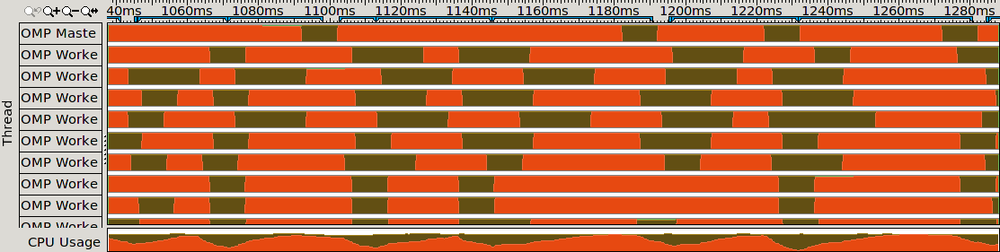
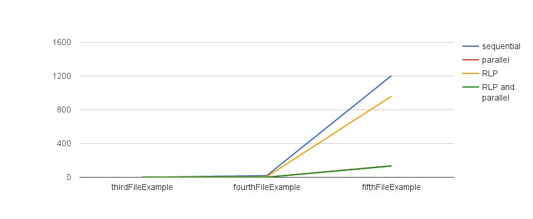
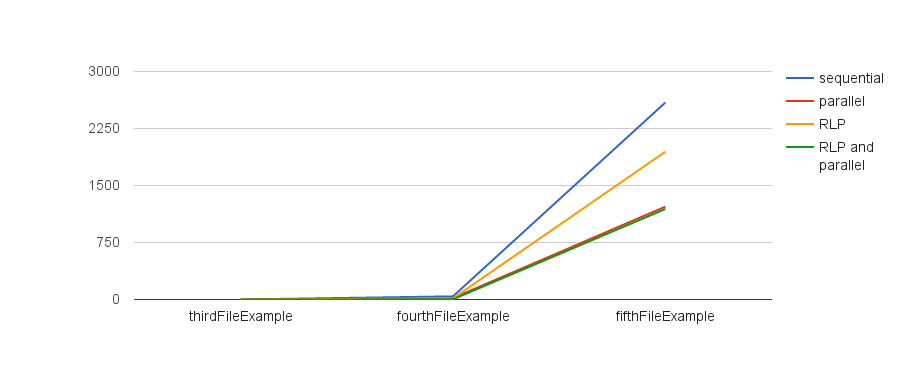
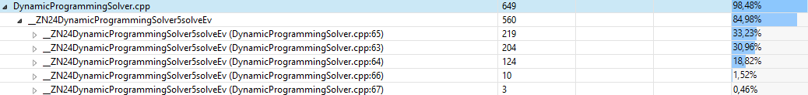

[TOC]

This is the result of the project in the course *High Performance Computing* at the University of Applied Sciences Kaiserslautern in the semester SS2015 . The aim of the project was to implement an algorithm that solves the knapsack problem and improve this algorithm to a faster and parallelized version. The project was performed by

* Kevin Keßler (keke0002@stud.hs-kl.de) and
* Viktor Maier (vima0001@stud.hs-kl.de).

# Build and Tests #
We use CMake [[9](#references)] to build the project. On a Linux distribution the build can be easily done by executing the following commands:

~~~{.sh}

mkdir build
cd build
cmake /path/to/hpc-knapsack/
make

~~~

This will generate Unix Makefiles. Alternatively the *cmake-gui* can be used for easier handling of the available options.
Note that OpenMP [[4](#references)] has to be installed. CMake tries to find it. In case it is not installed *cmake* will not continue generating.

To run the tests after building, simply run *make test* or *ctest* in the build directory.

# The Knapsack Problem
You have a knapsack with a limited capacity and a pool of items from which you can choose to put into the knapsack. All items have the properties weight and worth/profit. The problem is that you have to pack the knapsack in such a way that the sum of the item weights does not exceed the capacity of the knapsack. Furthermore the sum of the profit of all items needs to be maximized. This problem is known to be in the set of NP-complete problems. This means effort to solve such a problem increases exponentially with the input size, in our case list of items (and capacity of the knapsack).

# Framework
A small execution framework has been developed. This section describes the package / directory structure of the project and the framework.

## Packages
**main**

This package contains the most important part of the project. The file *Main.cpp* contains the application's entry point `int main(int argc, char* argv[])`. The created binary *knapsackStarter* (see section [Build and Tests](#section_build)) executes this main function.

//TODO: optionale parameter zu knapsackStarter

The classes KnapSack and KnapSackSolver and the package *algorithms* are also contained here.

**res**

This directory contains the input files for the knapsack problem. During the CMake project generation this directory will be copied to the build directory. The syntax explains itself best by an example:

~~~
15.0 4 5
XXL blue 0x                  2.0 2.0
gray mouse                    1.0 2.0
big green box                 12.0 4.0
yellow daisy                   4.0 10.0
salmon mousse                 1.0 1.0
~~~

The first line contains information about the knapsack and the following items. *15.0* is the capacity of the knapsack. *4* represents the number of exemplars of each item. *5* is the number of distinct items and also the number of the following lines. Each of the following lines represents an item. The line consists of a name with a maximum of 13 characters, followed by the item's weight and profit/worth. For example the item with the name *gray mouse* has a weight of *1.0* and a worth of *2.0*. The following table shows the capacity and the number of items of the files/problems and thus gives an overview over the complexity of the different problems:

| Name                  | Capacity of knapsack | # Items (=exemplars*distinctItems) |
|-----------------------|----------------------|------------------------------------|
| firstFileExample.txt  | 15                   | 20                                 |
| secondFileExample.txt | 15                   | 6                                  |
| thirdFileExample.txt  | 645                  | 56                                 |
| fourthFileExample.txt | 4645                 | 56                                 |
| fifthFileExample.txt  | 45000                | 7500                               |
| sixthFileExample.txt  | 150000               | 25000                              |
| dpExample.txt         | 45000                | 10000                              |

The script *run_and_collect_statistics.sh* within the package is used with *cron* to collect algorithm statistics over night.

**test**

This package stores our unit tests. We use CMake to create and execute the tests. These tests are executables. In case they terminate with the result code 0, the test will be treated as passed. If the return code is not equal to 0, the test failed. [ctest](http://www.cmake.org/Wiki/CMake/Testing_With_CTest) can be used to execute the tests (see section [*Build and Tests*](#section_build)). The header file *TestData.h* contains the commonly used test data, for example paths to test files or assumed solutions. There is a test for each implemented algorithm and further tests for testing input and output operations. Accordingly, during development it was easy to track if changes to the code affected our previous implementations in an undesired way.

**util**

This package stores helper classes. They provide helpful functions for string and IO operations like writing solutions or statistics to file.

## Algorithm Execution Framework
To avoid duplication of code for common tasks, we use a small algorithm execution framework, represented by the abstract class KnapSackSolver. This class is responsible for the following tasks:

* Reading input files (supported by KnapSackReader)
* Writing solutions (supported by KnapSackWriter)
* Executing algorithms and measuring time  (supported by GetWalltime.h)
* Collect and write statistics for benchmarks  (supported by StatisticsWriter)

A knapsack solving algorithm has to extend the class KnapSackSolver and implements the function *solve()*. Thus one can concentrate on the implementation while blinding out the management details. Additionally the class provides the functions *KnapSackSolver::setUp()* and *KnapSackSolver::tearDown()*. The first function can be used to prepare data in front of each run. The latter can be used to make some finishing operations. The two functions will not be included in the time measurement. The idea behind is that we have a strict input format represented by the class KnapSack, but some algorithms need a different structure and may use the structure directly without conversion. Thus, we exclude the input conversion from time measurement. Additionally, the time spent executing those functions is negligible.

The following snippet provides a minimal implementation of an algorithm (taken from test class KnapSackSolverTest):

~~~{.cpp}
class SolverImpl: public KnapSackSolver {
public:
	SolverImpl(std::string inputFilename, std::string outputFilename, int nrOfExecutions=1)
	: KnapSackSolver(inputFilename, outputFilename, "Solver Test", nrOfExecutions)
	{
	}

	virtual void solve() {
		// For the test we will just put every possible exemplar into the solution
		KnapSackItem* items = knapSack.getItems();
		for(int i=0; i < knapSack.getNumOfItems() ;++i) {
			itemsOfSolution.insert(itemsOfSolution.end(), items[i]);
		}
	}
};
~~~

Internally the algorithm can be executed with the following lines:

~~~{.cpp}
KnapSackSolver* solver = new SolverImpl(KNAPSACK_INPUT_FILE, TEST_OUTPUT_FILE);
solver->start();
delete solver;
~~~

This will solve the problem given by *KNAPSACK_INPUT_FILE* and write the solution to *TEST_OUTPUT_FILE*. It will also write a statistic file containing the mean and the root mean square error of the execution durations.

# Algorithms
This section documents the development process. It describes the different approaches that have been attempted and explains the implementation of the different algorithms. Three basic algorithms have been implemented:

* A naive brute force algorithm
* The algorithm of Nemhauser and Ullmann, which shows a more clever approach to solve the knapsack problem
* A more famous algorithm based on a Dynamic Programming approach

The last two algorithms exist in various improved and parallelized versions. 

The following table shows the computers and their benchmark data, which were used during development to implement and test the different approaches:

| Name          | CPU                                                               | Main Memory | OS                                    | Compiler                                |
|---------------|-------------------------------------------------------------------|-------------|---------------------------------------|-----------------------------------------|
| hal           | 4x Xeon E5-4620 (2,2GHz 8 cores) == 64 cores with Hyper-Threading | 128 GB      | Scientific Linux release 6.6 (Carbon) | icpc (ICC) 15.0.1 20141023 (Intel)      |
| Tower | Intel(R) Core(TM) i5-3470 (3.20GHz 4 cores)                       | 8 GB        | Ubuntu 14.04.2 LTS                    | gcc 4.8.4 |
| Laptop | 1x Intel(R) Core(TM) i7-4710MQ (2.50GHz 4 cores) == 8 cores with Hyper-Threading                      | 16 GB        | Windows 8.1 Pro 64-Bit                   | mingw-gcc 4.8.4 |

## Brute Force
The most naive approach for solving the knapsack problem is the so called *Brute Force* approach. Brute Force is a trial and error method which finds the best solution through exhaustive effort by trying every possible combination. Accordingly, its running time increases exponentially with the complexity of the problem. Thus this algorithm belongs to the complexity class O(2^n) where n is the number of available items.

**Implementation:**

See class BruteForceSolver.

It was the first approach implemented during the project and was used to get a proper feeling and understanding of the knapsack problem itself on the one hand and to show how inefficient an exhaustive search for NP problems is on the other hand. The algorithm provides correct solutions and is sufficiently fast for very small problems. As soon as the complexity of problems increases, however, the algorithm can not deliver the solutions in suitable time.

**Measurement:**

The measurement for this algorithm has been performed on *Laptop* (see [computers table](#computers_table)). At first it was used multiple times to solve the very simple problem firstFileExample.txt, which contains 20 items (see [input files table](#input_files_table)). Accordingly, the algorithm had to try 2^20 combinations to find the best solution.

~~~
Alogrithm;Brute Force (Sequential)
Number of Executions;5
Average Duration;0.2821
RMS Error;0.0083
1;0.2982
2;0.2812
3;0.2754
4;0.2782
5;0.2772
~~~

As one can see, the algorithm delivered the solution in suitable 0.2821 seconds. This is simply because there were only 2^20 combinations to try. A more complex problem, for example fourthFileExample.txt [input files table](#input_files_table)), would require 2^56 combinations to be tried, which corresponds to ~69 billion times 2^20 combinations. Accordingly it would take 69 billion times 0.2821 seconds or 614 years to solve the problem. This shows how unsuitable this algorithm becomes when solving complex problems. Even parallelization would not make it more suitable. Assuming we could fully parallelize the algorithm, so we would gain a factor of n where n is the number of available cores. In this case we would still need 614\*356\*24\*3600 cores to be able to solve the previous problem within one second. Because of this insight, we concentrated on implementing more promising algorithms rather than wasting time on parallelizing this one.

## Algorithm of Nemhauser and Ullmann
The idea of this algorithm is based on the plot worth vs. weight [[1](#references)]. Every possible combination represents a point in the plot. For example a point could be consist of item1, item2 and item3. The point would be located at

~~~
x = w1 + w2 + w3,
~~~

where w\* is an abbreviation for weight of item\* (\* represents here a wildcard for 1, 2, and 3) and

~~~
y = p1 + p2 + p3,
~~~

where p\* is an abbreviation for profit (or worth) of item\*. The following figure shows an example (figure taken from [[1](#references)]):

The optimal solution is represented by the point with the highest profit and a weight smaller than the capacity, which is represented by the red line in the figure.
In this plot only the most upper points are interesting. These so called Pareto-optimal points are the red colored ones of the figure. Being a Pareto-optimal point means that there is no other point that has lower weight and higher profit at the same time. With other words there is no point in the left upper quarter of the Pareto-optimal one.
To solve the knapsack problem it is possible to omit all the points which are not Pareto-optimal. During construction we can omit a lot of points to check.

For example if we have two Pareto-optimal points we can add another item to the two points. We will receive two new points which are shifted to the right by the weight of the new item and upwards by the profit of the new item. The following figure illustrates the extension of the points with a further item (figure taken from [[1](#references)]):

If we examine each two points independently then all points are Pareto-optimal (note, not all of the blue points are Pareto-optimal). However, it could be that one point from one set could have a point in the upper left quarter and thus would not be Pareto-optimal anymore. We can omit such points to have only Pareto-optimal points again. Now, another item can be added.

### Sequential implementation
Following listing roughly shows the algorithm which is implemented in the function solve() of the class NemhauserUllmannSolver:

~~~
L_0 := [(0,0)]  // A list with pareto optimal points. In the beginning only the point (0,0) is available
foreach item x in input do:
      1. Copy new items in L'_i
      	L'_i := L_i + x  // This means create a new list L'_i with points equal to the list L_i and add to all points the current item x (weight and worth)
      2. Remove not pareto-optimal points in lists L_i and L'_i
      3. Merge both list sorted
      	L_{i+1} := sort_with_ascending_weight( L_i, L'_i )
After adding all items the optimal solution is at the end of list L_n where n is the number of input items.
~~~

A performance analysis with Eclipse and gprof[2,3] revealed that the algorithm spends 90 percent of his runtime in the function betterPointExists(). Here is the main line of **gmon.out**

~~~
# Name (location)                               Samples   Calls         Time/Call     % Time
betterPointExists(PlotPoint*, PlotPoint*, int)	57	       167636	   3.400us	     90.47619
~~~

The implementation of this function can be found in the class NemhauserUllmannSolver. This function checks for a given point if a given list contains a point located in the left upper quarter. Basically it is a sequential search on a sorted list with a stop criteria. In every 'foreach item' iteration we have to check for every point in L\_i if there is a better Point in L'\_i and vice versa by searching the lists. All searches of one iteration are independent of each other and can be parallelized.

The following paragraph describes the complexity of this algorithm. First we take a look at the storage complexity. The only remarkable storage is used for the three lists *list0*, *list1* and *list2* in NemhauserUllmanSolver. These lists represent L\_i, L'\_i and L\_{i+1}. In worst case, one list needs **2^n** points. The worst case occurs, if we solely have items whose weight and profit are equal. Thus all points would be Pareto-optimal, which would result in a line on the plot. In general this is not the case. It is difficult to guess the maximal number of Pareto-optimal points. We simply take 100000 points due to previously observed runs of the algorithm with the input files from *res/*. One PlotPoint has the size of 24 bytes. The size of a list is

~~~
100000 * 24 bytes = 2400000 bytes = 2343.75 kb = 2.29mb
~~~

We have three lists, so we need approximately 6.9mb for the lists. Space  is not the bottleneck of this algorithm.  
The time increases exponentially with the input because the size of the lists become bigger and bigger and two searches are necessary, one in each of the lists L\_i and L'\_i.

### Parallelization

Since most of the sequential algorithm's running time will be spent by checking of better points exist and since a search for a single point is independent, the algorithm is ideally suited for parallelization. The detection for better points in the sequential algorithm is strongly coupled to the merging of the lists L\_i and L'\_i into L\_{i+1}. Before it can be parallelized it has to be decoupled from merging. This was done in commit 903ca0fb8f0ab2a94cd20cd2951933b790f6c15d. The detection was moved into the function NemhauserUllmannParallelSolver::markAllNonOptimalPoints. Afterwards OpenMP (Open Multi-Processing) [[4](#references)] was used to parallelize the for-loop. The following code snippet shows the code for detecting non-Pareto-optimal points for one list:

~~~{.cpp}
#pragma omp parallel for if (ctr1 > THRESHOLD_OF_ITEMS_TO_PARALLELIZE)
for (int i=0; i < ctr1 ;++i) {
	if (betterPointExists(&(list1[i]), list2, ctr2))
		list1[i].worth = NEG_VALUE_FOR_MARKING_NOT_OPTIMAL_POINTS;
}
~~~

Note, if a point is not Pareto-optimal, the worth of this point is set to NEG_VALUE_FOR_MARKING_NOT_OPTIMAL_POINTS. Thus, these points can be easily omitted in the process of merging. In the omp-pragma we only perform parallelization, if the list has more items then THRESHOLD_OF_ITEMS_TO_PARALLELIZE. The reason is that if only a few points have to be checked, then it is faster to do it single threaded rather than to start and synchronize separate threads. The value also depends on the number of threads. For simplicity the value was determined by several test runs on *Tower* (see [computers table](#computers_table)). The best execution time delivered a value of 100 (from 1, 100, 500 and 1000). Note also that the workload of the single iterations are different. The first points to check have a small weight. Thus there will be less points to check because the function betterPointExists() breaks if it encounters the first point with a greater weight.  
The copying of the points from list L\__i to L'\_i was parallelized, too:

~~~{.cpp}
// Create L'_i: This list contains all points of L_i plus the currentItem
#pragma omp parallel for if (cL_i > THRESHOLD_OF_ITEMS_TO_PARALLELIZE)
for (int j=0; j < cL_i ;j++) {
	LPrime_i[j].worth = L_i[j].worth + currentItem->worth;
	LPrime_i[j].weight = L_i[j].weight + currentItem->weight;

	// Copy items and ...
	*(LPrime_i[j].containingItems) = *(L_i[j].containingItems);
	// ... add currentItem
	LPrime_i[j].containingItems->insert(LPrime_i[j].containingItems->end(), currentItem);
}
~~~

First time measurements showed, that the execution time improved from ~20 to ~2 seconds on *hal* (see [computers table](#computers_table). The parallel algorithm was analyzed with the analysis tool *Intel VTune Amplifier* [[5,6](#references)]. The following screen shows the overview of the *OpenMP Analysis*.

The most remarkable part is the *Potential Gain* of 59.6% stated in the last line. This is basically the time wasted while waiting and synchronizing. The workload of the threads can be analyzed as well. Therefore, Intel VTune Amplifier provides the following visualization:

The brown areas state that a thread is actually calculating something whereas the red color shows the spin and overhead time. As indicated by the *OpenMP Analysis* there is a lot of spin and overhead time. This is mostly the case when the threads are synchronizing. The function NemhauserUllmannParallelSolver::markAllNonOptimalPoints() is being called after an input item has been added. Inside the function, there are two parallelized for-loops. One for L\_i and one for L'\_i. Let n be the number of input items, then we encounter 3n parallelized for-loops: 2n in markAllNonOptimalPoints() and n in solve() for copying the items. Thus, the threads have to be synchronized a lot. Unfortunately there is no way to avoid this and most of the time is still being spent during the detection of non-Pareto-optimal points.

### Removing Lightest Points (RLP)

To improve the algorithm further, we need to improve the detection of non-Pareto-optimal points. If we take a look at the plot of the points (see figure [Example Plot](#pareto_example_plot)) then we could ask ourselves: is it really necessary to check all Pareto-optimal points? We already omitted all points with a weight greater than the knapsack's capacity but it is also possible to omit points from the beginning of the list L\_i.  
In the beginning we have the item pool's remaining worth r_1 of

~~~
r_1 = p_1 + p_2 + ... + p_n
~~~

where n is the number of input items. In the i-th iteration and before adding the i-th item, we have a remaining worth r_i of

~~~
r_i = + p_i + p_{i+1} + ... + p_n
~~~

The basic idea is: if the worth of the lightest point s in list L\_i can not reach the heaviest point h in list L\_i

~~~
s + r_i < h,
~~~

then we can omit this point. This is realized within NemhauserUllmannRLPParallelSolver::removeHopelessPoints() and done in commit bb0ae2775070a2cd1059a14c552ffb5b65c80523.

A further improvement of this algorithm could be to sort the item pool by ascending worth. The idea behind this, is that we first add the items with the highest worth and thus can remove *hopeless* points earlier. Accordingly, the class NemhauserUllmannSolverRLP has a further parameter in the constructor. However, some test runs revealed the opposite: the running time increased when sorting the item pool. Thus the idea was discarded.

First time measurements of the RLP version showed a reduction of running time from ~20 to ~7 seconds. Most of the time still is spent during the detection of better points.

### Parallelization of RLP
The RLP algorithm is based on the sequential algorithm. It can be parallelized in the same way as NemhauserUllmannParallelSolver (see section [Parallelization](#section_nemull_parallelization)). The result is implemented in the class NemhauserUllmannRLPParallelSolver.

### Conclusion
This section compares the measurements of the different algorithms of Nemhauser and Ullmann. The following table shows the collected time measurements. Each entry represents the mean of ten execution runs. The value after the &plusmn; sign represents the [RMS error](http://statweb.stanford.edu/~susan/courses/s60/split/node60.html) which indicates the oscillation of the measured values around the mean value. The data was collected on *hal* (see [computers table](#computers_table)) and intel's compiler *icpc* was used to compile the binaries.

| Name                                    | firstFileExample.txt | secondFileExample.txt | thirdFileExample.txt   | fourthFileExample.txt   | fifthFileExample.txt     |
|-----------------------------------------|----------------------|-----------------------|------------------------|-------------------------|--------------------------|
| **NemhauserUllmann (sequential)**       | 0                    | 0                     | 0.1923 &plusmn; 0.0002 | 19.6745 &plusmn; 0.0759 | 1204.752 &plusmn; 0.9433 |
| **NemhauserUllmann (parallel)**         | 0                    | 0                     | 0.0169 &plusmn; 0.0404 | 1.6486 &plusmn;  0.0781 | 136.253 &plusmn; 0.9996  |
| **NemhauserUllmann (RLP)**              | 0                    | 0                     | 0.0726 &plusmn; 0.0043 | 6.5032 &plusmn;  0.0119 | 961.0731 &plusmn; 41.211 |
| **NemhauserUllmann (RLP und parallel)** | 0                    | 0                     | 0.0239 &plusmn; 0.0008 | 0.2921 &plusmn; 0.0874  | 133.1148 &plusmn; 0.1533 |

The following plot shows the measured times for the last three example files.

The problems of the first three files produced no significant running times. The last files, however, are more interesting. The *sixthFileExample* (see [input file table](#input_files_table)) was omitted in this table since it took more than one hour to run the parallel version. All parallel algorithms are faster than the sequential algorithms. The difference of the speedup between the parallel and the RLP (parallel) algorithms are completely different for the fourth and fifth file example. In the first case it is 1.6486/0.2921=5.644 and in the latter one 136.253/133.1148=1.0236. This shows that the RLP version will not always accelerate the computation significantly.

Below are the results from [Tower](#computers_table), a computer with 4 cores:

| Name                                    | firstFileExample.txt   | secondFileExample.txt | thirdFileExample.txt   | fourthFileExample.txt   | fifthFileExample.txt      |
|-----------------------------------------|------------------------|-----------------------|------------------------|-------------------------|---------------------------|
| **NemhauserUllmann (sequential)**       | 0.0018 &plusmn; 0.0001 | 0                     | 0.4846 &plusmn; 0.0011 | 41.405 &plusmn; 0.0064  | 2591.654                  |
| **NemhauserUllmann (parallel)**         | 0.0035 &plusmn; 0.0025 | 0                     | 0.252 &plusmn; 0.0073  | 18.3329 &plusmn; 0.0522 | 1221.427 &plusmn; 2.985   |
| **NemhauserUllmann (RLP)**              | 0.0005 &plusmn; 0      | 0                     | 0.1805 &plusmn; 0.0005 | 14.6303 &plusmn; 0.0048 | 1943.9145 &plusmn; 0.5908 |
| **NemhauserUllmann (RLP und parallel)** | 0.0011 &plusmn; 0.0009 | 0                     | 0.212 &plusmn; 0.0099  | 2.7437 &plusmn; 0.0825  | 1190.6925 &plusmn; 6.2025 |

Here is the *fourthFileExample* interesting. The RLP version is faster than the parallelized. This indicates again that the problem of *fourthFileExample* is advantageous for the RLP algorithms. On the other side the difference between the parallel and the RLP (parallel) algorithms for the *fifthFileExample* is rather small.

The RLP version should not be used if there are only items with the same weight and worth because this represents the worst case and the storage complexity would be O(2^n). The parallelized version of the algorithm boosts the calculations of big problems a lot but a significant amount of time is wasted while synchronizing the threads. This cannot be avoided since the most outer loop has dependencies and thus cannot be parallelized any further.

## Dynamic Programming

The Dynamic Programming approach for solving Knapsack-Problems is based on splitting the main-problem into its sub-problems. For each of those (simpler) sub-problems the maximum profit is being calculated in order to calculate the maximum profit of the main-problem. At that, the sub-problems with a maximum capacity of zero and those with an item pool of zero items, serve as induction basis. The maximum profit of those sub-problems automatically stays zero since you can not pick up items into a knapsack without any capacity or without any items to pack. Starting from this basis, more complex problems can be calculated. Let p(i,w) be the maximum profit of the sub-problem with an item pool i and a maximum capacity of w. Beginning with p(0,0) the problems can be extended bit by bit. After all capacities in combination with the current pool have been evaluated, another item is added to create the next bigger sub-problem. With c being the maximum capacity of the main-problem and n being the number of items within the pool, the process can be described as follows: Starting from p(0,0), problems up to p(0,c) are being solved (induction basis, each is zero). Afterwards those calculated values are being used to solve problems p(1,0) to p(1,c) and those again are used to solve p(2,0) to p(2,c) and so on. After all sub-problems have been solved, the maximum profit of the main problem is represented by p(n,c).

The development of the different dynamic programming algorithms took place on *Laptop* (see [computers table](#computers_table)). Accordingly, all of the measurements and performance analyses contained in this section were performed on that machine. Furthermore, those measurements were performed while solving the same problem equally often. This setup was necessary to stick with the same environment to gain comparable measurements. The problem used for all measurements can be found in *dpExample.txt* (see [input files table](#input_files_table)). The file describes a problem with a capacity of 45000 and an item pool of 10000 items.

### Default Version ###

**Based on pseudo code of:**

[[7](#references)], DP-1, p.22

**Implementation:**

See class DynamicProgrammingSolver.

A result table [n x c] serves as underlying data structure of the default implementation. Each entry of the table represents the maximum profit of the respective sub-problem p(i,w). The table is being populated by the previously described process, such that the solution of the main-problem resides in the last column of the table's last row (n,c). After the calculations are done, the list of items contained within the solution is being backtracked starting from the position (n,c).

**Measurement:**

In order to find out where the default algorithm can be optimized, it has been applied several times to the dynamic programming example problem. The average duration for solving the problem with this algorithm was 1.8431 seconds.

~~~
Algorithm;Dynamic Programming (Sequential)
Number of Executions;5
Average Duration;1.8431
RMS Error;0.0158
1;1.8467
2;1.8326
3;1.8463
4;1.8685
5;1.8213
~~~

**Performance Analysis:**

After solving the problem several times the algorithm was subject to a performance analysis, which yielded that the algorithm spent more than 80% of the duration within the inner for-loop (lines 63 - 68).

~~~{.cpp}
63  for(int c=itemWeight; c < weightColumns; c++){
64	      int worthOfNotUsingItem = table[i-1][c];
65	      int worthOfUsingItem = itemWorth + table[i-1][c-itemWeight];
66	      if(worthOfNotUsingItem < worthOfUsingItem)
67	  	           table[i][c] = worthOfUsingItem;
68  }
~~~

If you could parallelize this loop, you could expect a significant reduction of the time needed for solving the problem.

### Parallelized Version ###

**Idea:**

The inner for-loop is responsible for calculating the columns of the current item row. Luckily those columns are independent from each other. Thus the calculation of each row's columns can be done in parallel. The rows themselves still have to be calculated one after each other because they are depending on each other (row i+1 depends on row i).  

**Implementation:**

See commit 37d359775aa49bac04f25ea1d1b1eee939fe3a09

By using OpenMP it was very easy to implement the idea of the parallelization. Therefore the following pragma was used:

~~~{.cpp}
#pragma omp parallel for if(weightColumns > DynamicProgrammingParallelSolver::PARALLEL_CAPACITY_THRESHOLD)
for(int c=itemWeight; c < weightColumns; c++) { ... }
~~~

The pragma causes the loop to be divided into equally sized parts which are distributed among n threads, where n is the number of cores available. Because starting separate threads is consuming a lot of resources, a threshold condition has been added which ensures that separate threads are only instantiated when the problem to solve owns a certain complexity. If you would go without the threshold condition at this point and thus would start separate threads for even very small problems, then the process of starting the threads would already take more time than just solving the problem sequentially.

A closer look at the differences of the parallel and sequential implementation shows that the inner loop of the parallelized version starts at `i=1` while the loop of the sequential version starts at `i=itemWeight`. This is because, in the sequential case, it is more favorable to preallocate the current row with the values of the previous row since we can save one if-condition for each iteration. The parallel version, however, profits from this if condition within the loop rather than copying the allocation. This is because the workload of the loop is being distributed among the threads. Alternatively to copying you could run the process of preallocation in a separate for-loop which can be parallelized. This has been attempted but was discarded because the workload distribution was worse than it was when having everything within one loop.

**Measurement:**

To compare the durations of this algorithm to the durations of the sequential one, the example problem has been solved and measured under the same circumstances. The average duration was 1.15 seconds. On first sight the parallelization provides a reduction of the duration from 1.84 seconds to 1.15 seconds what corresponds to a speedup of ~1.6.

~~~
Algorithm;Dynamic Programming (Parallel) (Version 1)
Number of Executions;5
Average Duration;1.1500
RMS Error;0.0104
1;1.1406
2;1.1508
3;1.1597
4;1.1361
5;1.1628
~~~

### Further Parallelization ###

**Idea:**

By looking at the introduced parallel implementation one can see that the `#pragma omp parallel` is written inside the outer loop. Thus you can assume that the threads for the inner loop are being instantiated again and again for each iteration of the outer loop. To prevent this you could try to instantiate them before the outer loop is being entered. Thus the inner loop would only access the threads instead of instantiating them.

**Implementation:**

See class DynamicProgrammingParallelSolver

The implementation was done by inserting a `#pragma omp parallel`-block in front of the outer loop. Accordingly the pragma of the inner loop has been changed to `#pragma omp for` (without the parallel keyword). However, there is a disadvantage that comes with this solution. Everything within the parallel-block is now being executed multiple times (once per core). Many different approaches have been tried to achieve single execution of the outer loop while the parallel-block is preceding. All approaches, e.g. `#pragma omp single`, `#pragma omp critical`, explicitly setting the number of threads, etc. resulted either in single execution of both loops or in having multiple parallel-blocks which caused a significant performance loss. Accordingly it remained to the multi-execution of the outer loop. Admittedly this does not change anything at the algorithm's result, but now it has to be examined how this affects the runtime.

**Measurement:**

Again the algorithm has been used to solve the example problem in the same environment as before to acquire comparable metrics. The average duration was 0.6989 seconds. In comparison to the first parallel version we gain a reduction of the runtime from 1.15 seconds to 0.7 seconds which corresponds to a speedup of ~1.64. Compared to the sequential version we fall from 1.84 seconds to 0.7 seconds and obtain an overall speedup of ~2.6.

~~~
Algorithm;Dynamic Programming (Parallel) (Version 2)
Number of Executions;5
Average Duration;0.6989
RMS Error;0.0136
1;0.6965
2;0.6825
3;0.7195
4;0.7085
5;0.6875
~~~

This shows that this parallel version of the algorithm is faster than the previous one. However it is not clear yet why this is the case. Assuming that the preliminary ideas are correct, one might suspect that the creation of threads in the inner loop produces more overhead than the multiple execution of the outer loop. However, this assumption would only be true if the threads actually are recreated in each iteration of the inner loop. Research in this regard revealed that most compilers implement a thread pool for OpenMP internally, so that after the first use of a `#pragma omp parallel` the threads are not being recreated and thus just being taken from the pool. Accordingly, the above explanation for the speedup is invalid. At this point, the obtained speedup feels absolutely anti-intuitive. Why should the execution become faster when the outer loop is executed more often and the thread management seems to stay the same? This question has been examined intensively. Ultimately, a public discussion on the collaborative question-and-answer page StackOverflow about this issue yielded a plausible answer [[8](#references)]. It turned out that only the outer loop is being executed multiple times. The inner loop is, in spite of the outer parallel block, only running once (distributed among all cores). In the first approach, all separate threads must wait for the main thread to reach the inner loop during the current iteration of the outer loop. Only then they are allowed to start the calculation of their workload. Since in the second approach each of the threads controls the outer loop by itself, they do not have to wait for any other thread. Thus they can start working on their workload immediately. In addition to that, these OpenMP parallel-blocks always define a group of threads which are taken from the thread pool. It might be that the allocation of those groups takes some significant time which would also be in favor of the second approach. Now that this has been investigated and explained, other aspects of the algorithm can be examined.

The algorithm is indeed very fast in solving knapsack problems, however, it still suffers from memory problems. Both previously implemented versions store the maximum profits of their sub-problems within a [i x w] matrix, where i is equal to the number of objects and w represents the maximum capacity. With increasing complexity of the problems, the matrix is getting larger and larger which, at some point, leads to memory problems. So to be able to handle very complex problems, we need an alternative data structure for storing the calculated sub-problem solutions.

### Sequential Memory Optimized Version ###

**Idea:**

Theoretically, the matrix can consist of only a single row by calculating its columns from back to front. Accordingly the previously calculated values of this row are used to calculate the values of the next iteration, which then override the previous ones. Thus, only one row is used for calculation and storage, which diminishes the used memory dramatically (from i\*w to w). However, this leads to the fact that the sub-solutions of the upper rows are no longer available when backtracking the packed items. Accordingly the overhead of backtracking increases, which will generally lead to longer durations. Nevertheless, this solution needs to be considered since very complex knapsack problems can be solved by it.

**Based on pseudo code of**:  

[[7](#references)], p.23 and p.47, DP-2 and Recursive-DP

**Implementation:**

See class DynamicProgrammingLowMemorySolver

As described in the idea section, instead of using the complete result table now only one row is being used. This is possible because the row gets filled from back to front and the values of the previous iteration are used for calculation:

~~~{.cpp}
54 for(int c=capacity; c >= itemWeight; c--){
55			int worthOfPickingItem = solutionRow[c - itemWeight] + itemWorth;
56			if( worthOfPickingItem > solutionRow[c])
57				solutionRow[c] = worthOfPickingItem;
58 }
~~~

In contrast to both of the previous approaches, this one causes the backtracking to become considerably complicated. During the backtracking, the item list gets divided into two sub lists of which each is used to apply the solution algorithm again. By using the new solutions you can determine the capacities which belong to the sub lists and thus repeat the procedure. Indeed the procedure is being repeated recursively until the lists consist of only one remaining element. This element is part of the solution list. To be able to call the solution algorithm multiple times, its logic has been transferred to a method called solveProblem(). The framework's solve() Method calls this method in order to calculate the maximum profit of the main problem and then starts the recursive backtracking by calling determineItemsOfSolutionRecursively().

**Measurement:**

Again the example problem has been solved multiple times, now by this algorithm, to determine which part of it can be optimized. The average running time was 2.9278 seconds. This shows that there is a significant speed loss in comparison to the standard sequential implementation, which only took 1.84 seconds for solving. However, this has been expected. It is the price you have to pay for having an algorithm that is able to solve complex knapsack problems while using less memory.

~~~
Algorithm;Dynamic Programming Low Memory (Sequential)
Number of Executions;5
Average Duration;2.9278
RMS Error;0.0405
1;2.9142
2;2.9244
3;2.9222
4;3.0013
5;2.8771
~~~

**Performance Analysis:**

By using the data, which has been collected during solving, a performance analysis has been performed by using Eclipse and gprof. The analysis yielded that the algorithm spends most of the time by solving sub problems. Accordingly it stays more than 98% of running time within the solveProblem() method.

Now it has to be examined how this time can be diminished.

### Parallel Memory Optimized Version ###

**Idea:**

A closer look at the solveProblem() method yields that only the initialization of the solution row can be parallelized. Opposing to the other sequential algorithm, the calculation of each of the row's columns can not be parallelized. This is because, due to the new structure, they are depending on each other.

However we can have a closer look at the backtracking (determineItemsOfSolutionRecursively()). There, the original item list is divided into two approximately equals parts. To each of those parts, the solution algorithm (solveProblem()) is being applied. This means for every recursive call of determineItemsOfSolutionRecursively() the solveProblem() method is called twice:

~~~{.cpp}
97  int* subSolutionRow1 = new int[rowLength];
98  int* subSolutionRow2 = new int[rowLength];
99  subSolutionRow1 = solveProblem(items1, numOfItems1, subSolutionRow1, rowLength, capacity);
100 subSolutionRow2 = solveProblem(items2, numOfItems2, subSolutionRow2, rowLength, capacity);
~~~

Those calls are completely independent from each other and can thus be delegated to two separate threads, while the main thread waits for them to finish. By this, a significant reduction of the running time should be achieved. Furthermore the backtracking algorithm is called recursively. For each call it will again be called twice recursively (once for each part of the item list). The recursion ends when the item list to divide has reached the size of one, which then represents the item that has been packed. The following listing shows the recursion within determineItemsOfSolutionRecursively().

~~~{.cpp}
117	if(numOfItems1 == 1 && subSolution1 > 0)
118		integerItemsOfSolution.insert(integerItemsOfSolution.end(), items1[0]);
119	else if(numOfItems1 > 1)
120		determineItemsOfSolutionRecursively(items1, numOfItems1, c1, subSolution1);
121
122	if(numOfItems2 == 1 && subSolution2 > 0)
123		integerItemsOfSolution.insert(integerItemsOfSolution.end(), items2[0]);
124	else if(numOfItems2 > 1)
125		determineItemsOfSolutionRecursively(items2, numOfItems2, c2, subSolution2);
~~~

Those two recursive calls (lines 120 and 125) are completely independent from each other. Thus they also could run in two separate threads to reduce running time even further.

**Implementation:**

See class DynamicProgrammingLowMemoryParallelSolver.

The two calls of the solving algorithm have been parallelized by using OpenMP sections.

~~~{.cpp}
108	// Runs the two independent solveProblem calls in two seperate threads.
    // By Default the sections block is waiting until all sections are finished.
109	#pragma omp parallel sections
110	{
111		//this section runs in a different thread than the next section
112		#pragma omp section
113			subSolutionRow1 = solveProblem(items1, numOfItems1, subSolutionRow1, rowLength, capacity);
114
115		//this section runs in a different thread than the previous section
116		#pragma omp section
117			subSolutionRow2 = solveProblem(items2, numOfItems2, subSolutionRow2, rowLength, capacity);
118	}
~~~

Each of the sections within the `#pragma omp parallel sections`-block gets an own thread assigned, which causes the two solveProblem() calls to run in parallel. In line 118 the main thread waits for the calls to finish before it executes the code below.

Similarly to this, it has been tried to parallelize the two recursive calls. This approach, however, has been discarded because the recursion caused to start more and more threads, which could not come to an end before the lists reached the size of one. Thus, for complex problems, a giant number of threads would be instantiated, which would cause the program to freeze or to run extremely slow. In future work one could try to use a helper variable to monitor the number of instantiated threads which could be used to only allow new threads if this number is below the number of available cores. However, this is pretty difficult to implement in combination with the above presented parallel sections. Each recursive thread would require two additional threads to perform the solveProblem() calls in parallel which would end in a pretty complex implementation. For time reasons, this approach has not been investigated any further.

**Measurement:**

The measurements of solving the example problem with this algorithm yielded an average running time of 2.2157 seconds. This is a reduction of roughly 700 milliseconds which corresponds to a speedup of ~1.32. As expected, this implementation is also slower than the standard implementation, however, it can handle much more complex problems.

~~~
Algorithmus;Dynamic Programming Low Memory (Parallel)
Anzahl Durchlaeufe;5
Durchschnittliche Laufzeit;2.2157
RMS Error;0.0604
1;2.3134
2;2.1674
3;2.1425
4;2.2083
5;2.2469
~~~

###Conclusion###

The following table gives an overview over the measurements of the different dynamic programming approaches and can be used to compare them. The columns "SU to #\*" stand for the speedup gained or lost in comparison to the respective approach identified by number. The measured data is the result of solving the problem *dpExample.txt* (see [input files table](#input_files_table)) five times on *Laptop* (see [computers table](#computers_table)) for each approach.

| # | Approach          | Average Duration | RMS Error | SU to #1 | SU to #2 | SU to #3 | SU to #4 | SU to #5 |
|:-:|-------------------|:----------------:|:---------:|:--------:|:--------:|:--------:|:--------:|:--------:|
| 1 | Default           |      1.8431s     |   0.0158  |     1    |   0.62   |   0.38   |   1.59   |   1.20   |
| 2 | Parallel (1)      |      1.1500s     |   0.0104  |   1.60   |     1    |   0.61   |   2.56   |   1.93   |
| 3 | Parallel (2)      |      0.6989s     |   0.0136  |   2.64   |   1.65   |     1    |   4.19   |   3.17   |
| 4 | Low Memory (Seq.) |      2.9278s     |   0.0405  |   0.63   |   0.39   |   0.24   |     1    |   0.76   |
| 5 | Low Memory (Par.) |      2.2157s     |   0.0604  |   0.83   |   0.52   |   0.32   |   1.32   |     1    |

As one can see, the second parallel version of the default dynamic programming algorithm is the fastest one. Compared to the sequential version of the low memory algorithm it is even more than four times faster. However, it's underlying result table structure restricts the algorithm to solve very complex problems. Of course, this is depending on the underlying system and on available memory. On *Laptop* the sixthFileExample ([see input files table](#input_files_table)), with a capacity of 150000 and an item pool of 25000 items, could not be solved by the algorithm because the table exceeded the available memory. In contrary, both of the low memory algorithms had no problems while solving even more complex problems than the sixthFileExample. This shows that if enough memory is available, the second parallel version should be used. Otherwise, the parallel low memory version is the way to go.

# Conclusion and Future Work

Three different approaches to solve the knapsack problem were introduced. The brute force algorithm showed a naive way to solve the problem by an exhaustive search on all possible combinations. No further investigations have been taken on this algorithm. The algorithm of Neuhauser and Ullmann is a more clever approach. Although this approach is heavily sequential, multiple sections were parallelized. Further, with reducing the number of PlotPoints, we were able to reduce the run times. However, none of the previous approaches can beat the Dynamic Programming approach. The only concern was the memory storage but this was removed with a modified version.

Te following table shows a compparison between the algorithm of Neuhauser and Ullmann and Dynamic Programming:

| Algorithm                        | fourthFileExample.txt   | fifthFileExample.txt     |
|----------------------------------|-------------------------|--------------------------|
| **NU (RLP and parallel)**        | 6.5032 &plusmn;  0.0119 | 961.0731 &plusmn; 41.211 |
| **DP (parallel)**                | 0.0015 &plusmn; 0       | 0.742 &plusmn; 0.0093    |
| **DP (low memory and parallel)** | 0.0028 &plusmn; 0.0029  | 1.5305 &plusmn; 0.004    |

It is obviously that Dynamic Programming should be preferred in practical use cases. The single disadvantage of Dynammic Programming is that it cannot handle floating point numbers. However Floating point numbers could be multiplied by 10^x, where x represents the number of decimal places, and  converted to integers. This raises the complexity of the problem by 10^x but this would still be faster.

Dynamic Programming is the favoured approach to solve the knapsack problem. It would be worth to investigate further in an improvement of this algorithm. One way could be parallelizing further sections as already mentioned [here](#future_work_dplm).

The effort of this project was approximately 80 hours per student, so overall 160 hours.

# List of References
* [1] Algorithm of Nemhauser and Ullmann http://www-i1.informatik.rwth-aachen.de/~algorithmus/algo15.php
* [2] gprof https://sourceware.org/binutils/docs/gprof/Compiling.html#Compiling
* [3] gprof eclispe manual https://wiki.eclipse.org/Linux_Tools_Project/GProf/User_Guide
* [4] OpenMP http://openmp.org/wp/
* [5] Intel VTune Amplifier https://software.intel.com/en-us/intel-vtune-amplifier-xe/
* [6] VTune Amplifier and OpenMP https://software.intel.com/en-us/articles/profiling-openmp-applications-with-intel-vtune-amplifier-xe
* [7] Kellerer, H & Pferschy, U & Pisinger, D 2004, *Knapsack Problems*, Springer Verlag
* [8] StackOverflow discussion thread http://stackoverflow.com/questions/31321071/openmp-nested-for-loop-becomes-faster-when-having-parallel-before-outer-loop/31382775
* [9] CMake http://www.cmake.org/
